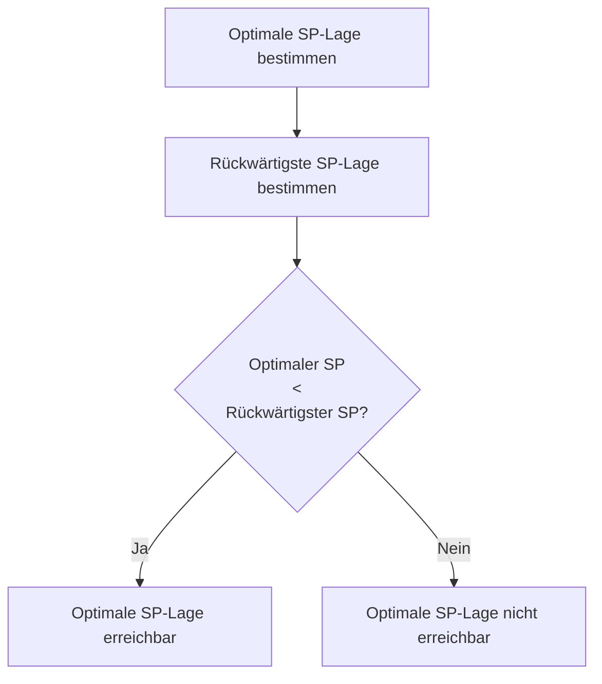

```mermaid
flowchart TD

step1[Optimale SP-Lage bestimmen] --> step2[Rückwärtigste SP-Lage bestimmen] 
if_opt_lt_aftcg{Optimaler SP \n < \n Rückwärtigster SP?}
step2 --> if_opt_lt_aftcg
if_opt_lt_aftcg --> |Ja| res1[Optimale SP-Lage erreichbar]
if_opt_lt_aftcg --> |Nein| res2[Optimale SP-Lage nicht erreichbar]
```